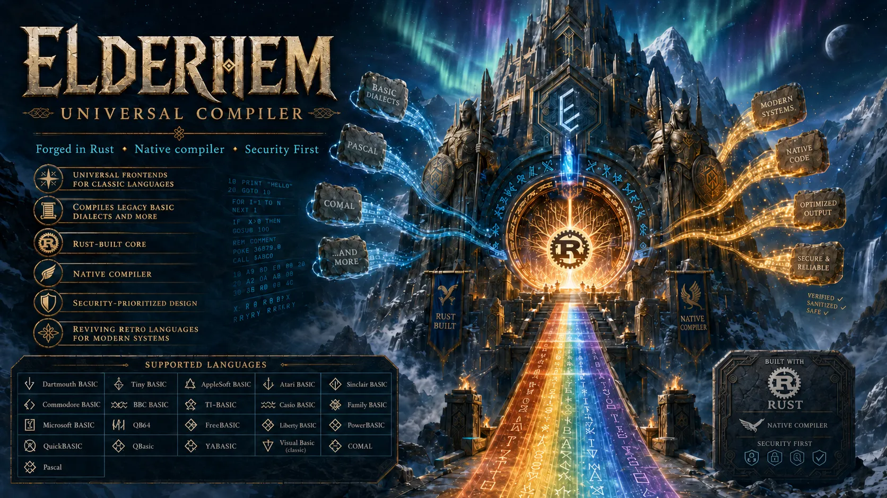

<p align="center">
  <b>Rust-native compiler platform for legacy languages.</b><br>
  Multi-frontend by design. Direct machine-code and executable-format output. Built for standalone release binaries.
</p>

<div align="center">
  <a href="docs/IMPLEMENTATION_PLAN.md">Implementation Plan</a>
  ·
  <a href="docs/RELEASE_PLAN.md">Release Plan</a>
  ·
  <a href="docs/RELEASE_PLAN.md#stop-gates-and-pentest-classes">Tag Stops</a>
  ·
  <a href="docs/modularity-policy.md">Modularity</a>
  ·
  <a href="docs/security-controls.md">Security Controls</a>
  ·
  <a href="docs/threat-model.md">Threat Model</a>
  ·
  <a href="docs/supply-chain-security.md">Supply Chain</a>
  ·
  <a href="SECURITY.md">Security</a>
</div>

<br>

<p align="center">
  
</p>

# elderheim

elderheim is a universal compiler platform for legacy languages. The first
supported language family is Dartmouth BASIC, specifically the locally planned
manual-backed profiles for Dartmouth BASIC versions 1, 2, and 4.

The intended release model is one downloadable `elderheim` compiler binary per
supported operating system and architecture. A user downloads `elderheim`,
chooses the source dialect explicitly, and compiles old source files without
installing Rust, `rustc`, Cargo, a C compiler, or a platform linker for the
supported release path.

The final supported release path is meant to be self-contained:

- A user downloads one `elderheim` binary for their OS and architecture.
- A user runs `elderheim --dartmouth-basic-1 program.bas -o program`.
- No Rust install is required.
- No `rustc` is required.
- No Cargo is required.
- No C compiler is required.
- No external assembler is required.
- No external linker is required for the supported release path.
- No Cranelift or LLVM backend is used.
- Old source code compiles through `elderheim` itself.

Temporary C, Cranelift, LLVM, system assembler, system linker, or external
runtime bridges are not part of the implementation strategy.

The first stable goal is `1.0.0`: prove the compiler platform with complete
manual-backed Dartmouth BASIC 1, then complete manual-backed Dartmouth BASIC 2,
then complete manual-backed Dartmouth BASIC 4. Dartmouth BASIC 3 stays reserved
until official documentation is available. Other BASIC variants and non-BASIC
language families are future frontends under `crates/languages/`, not
implementation claims in the foundation release.

Committed scope must not be half implemented. If a committed feature, profile,
target, report, or security control cannot be finished in its current stop, the
release plan must receive an explicit follow-up version such as `0.1.1`,
`0.2.1`, or the next minor stop before the current release is treated as done.
This rule does not turn out-of-scope work into a deferral: Dartmouth BASIC 4
means the documented source programming language, not Dartmouth timesharing
session, editor, account, file, paper-tape, or operating-system commands.

elderheim is licensed under `EUPL-1.2`.

## Historical Documentation

Elderheim depends on primary historical manuals to keep dialect support accurate.
We are looking for help finding original manuals, scans, specifications, and
era-appropriate reference texts for older programming languages.

The current priority search is:

- Dartmouth BASIC Third Edition / Version 3.
- Dartmouth BASIC Versions 5 through 7.
- SBASIC / Source BASIC / Structured BASIC variants.

The first local reference set is:

- Dartmouth BASIC First Edition, May 1964.
- Dartmouth BASIC Second Edition, October 1964.
- Dartmouth BASIC Fourth Edition, January 1968 text export.

If you have leads, public archive links, scans, or other historical language
references that may fit Elderheim, please reply here:
[Seeking historical programming documents for Elderheim](https://github.com/valkyoth/elderheim/discussions/2).

## What Works Today

`0.5.0` is the active source normalization workstream. It normalizes line
endings, enforces the first source byte/control-character policy, applies a
blank-line policy, preserves source-size limits, and produces stable source IDs
over normalized bytes.

No Dartmouth BASIC parser or executable writer is implemented yet. The roadmap
intentionally starts with compiler substrate, then makes BASIC 1 complete,
then BASIC 2 complete, then BASIC 4 complete.

### Compiler Foundation

| Capability | Status | Notes |
| --- | --- | --- |
| Cargo workspace | Working | Shared compiler crates live directly under `crates/`; language frontends live under `crates/languages/`. |
| Rust toolchain pin | Working | Stable Rust `1.96.1`, edition 2024, workspace resolver `3`. |
| License | Working | EUPL-1.2. |
| no_std library skeletons | Working | Core/facade crates are prepared for no_std production logic. |
| Source and diagnostics core | Working | `elderheim-core` validates source byte and line limits, maps byte offsets to one-based line/column locations, checks spans, and renders compact stable diagnostics. |
| Source normalization core | Working | `elderheim-core` normalizes LF/CRLF/CR into LF, rejects invalid control/non-ASCII bytes under the current policy, enforces blank-line policy, and returns stable normalized source IDs. |
| Compiler pipeline skeleton | Working | `elderheim-core` exposes ordered source-to-diagnostic, HIR-to-MIR, MIR-to-LIR, and LIR-to-target stages with fail-fast diagnostics and report sink events. |
| Target matrix identifiers | Working | Linux `x86`/`x86_64`/`aarch32`/`aarch64`, Windows `x86_64`, and macOS Apple Silicon `aarch64` are represented with CLI-visible names and stable rejection diagnostics. |
| Dartmouth BASIC crate | Scaffolded | Active first language-family crate: `crates/languages/elderheim-dartmouth-basic`. |
| Direct backend plan | Planned | Native output is planned through Elderheim-owned instruction encoders and executable writers, not Cranelift, LLVM, C, or Rust transpilation. |
| ELF writer | Scaffolded | `elderheim-format-elf` is present for future ELF32/ELF64 work. |
| x86 backend | Scaffolded | `elderheim-backend-x86` is present for future x86 32-bit and x86_64 work. |
| Release/security gates | Working | Formatting, doc links, modularity, clippy, tests, cargo-deny, cargo-audit, and SBOM generation pass locally. |
| Pentest/tag stops | Planned | Every planned tag has a stop gate and pentest class in the release plan. |

### Language Support

Compatibility is tracked per concrete language or dialect, not by loose family
names. A dialect is marked complete only after manual-backed fixtures, target
fixtures, release gates, and pentest evidence pass.

| Language or dialect | Status | Comment |
| --- | --- | --- |
| Dartmouth BASIC First Edition (`dartmouth-basic-1`) | Planned for first implementation line | BASIC 1 must reach complete manual-backed language support before BASIC 2 begins. |
| Dartmouth BASIC Second Edition (`dartmouth-basic-2`) | Planned after BASIC 1 | Added as an explicit compatibility expansion over proven BASIC 1 behavior. |
| Dartmouth BASIC Third Edition (`dartmouth-basic-3`) | Reserved | No official documentation is available locally; not part of `1.0.0`. |
| Dartmouth BASIC Fourth Edition (`dartmouth-basic-4`) | Planned after BASIC 2 | Added only after BASIC 2 reaches its compatibility stop. |
| Other Dartmouth BASIC editions | Reserved | Need primary manuals before scheduling. |
| Other BASIC variants | Future | Planned only after source material and release scope are ready. |
| Non-BASIC languages | Future | The platform is designed for future language-family crates, but none are active in the foundation. |

## Why elderheim

- **Standalone compiler goal**: released binaries should compile supported
  source files without requiring users to install Rust, Cargo, a C compiler, an
  external assembler, or an external linker for the supported release path.
- **Rust first**: memory-safe implementation with a pinned modern Rust
  toolchain.
- **Direct native output**: Elderheim owns the machine-code backend and
  executable-format writer instead of shelling out to Cranelift, LLVM, C,
  Rust, assemblers, or linkers.
- **Language-family frontend crates**: each language family gets its own crate
  under `crates/languages/` when source material and release scope justify it.
- **Security first**: unsupported constructs fail explicitly, dependencies are
  audited, releases require SBOM evidence, and every tag has a pentest class.

## Quick Start

Run the full local gate:

```bash
scripts/checks.sh
```

Run the release-candidate gate before asking the maintainer to push and wait
for GitHub Actions / CodeQL:

```bash
scripts/validate-release-candidate.sh v0.5.0
```

Run the dependency and advisory gates:

```bash
cargo deny check
cargo audit
```

Generate an SBOM:

```bash
scripts/generate-sbom.sh
```

Run the current CLI scaffold:

```bash
cargo run -p elderheim --bin elderheim
```

List supported 1.0 target names:

```bash
cargo run -p elderheim --bin elderheim -- --list-targets
```

Validate a target name:

```bash
cargo run -p elderheim --bin elderheim -- --target linux-x86_64-elf64
```

## Workspace

```text
elderheim/
├── crates/
│   ├── elderheim/                  # no_std facade library and CLI shell
│   ├── elderheim-core/             # source, spans, diagnostics, pipeline, limits
│   ├── elderheim-ir/               # HIR/MIR/LIR and pipeline boundary contracts
│   ├── elderheim-target/           # target and format identifiers
│   ├── elderheim-backend-x86/      # x86 32-bit and x86_64 backend contracts
│   ├── elderheim-format-elf/       # ELF32/ELF64 writer contracts
│   └── languages/
│       └── elderheim-dartmouth-basic/
├── docs/
├── release-notes/
├── scripts/
├── security/
└── tools/
```

## Documentation

| Document | Purpose |
| --- | --- |
| [Implementation Plan](docs/IMPLEMENTATION_PLAN.md) | Compiler architecture, workspace shape, Dartmouth sequencing, and output strategy. |
| [Release Plan](docs/RELEASE_PLAN.md) | Granular roadmap from `0.1.0` through `1.0.0`. |
| [Release Procedure](docs/release-procedure.md) | Commit, tag, pentest-input, and CodeQL reporting policy. |
| [Tag Stops](docs/RELEASE_PLAN.md#stop-gates-and-pentest-classes) | Stop gate and pentest class for every planned tag. |
| [Target Matrix](docs/target-matrix.md) | Supported 1.0 target names and rejection diagnostics. |
| [Source Diagnostics](docs/source-diagnostics.md) | Source byte, span, limit, and diagnostic rendering contract. |
| [Source Normalization](docs/source-normalization.md) | Line ending, byte policy, blank-line, and source ID contract. |
| [Pipeline Contract](docs/pipeline-contract.md) | Compiler stage ordering, error propagation, and report sink contract. |
| [Modularity Policy](docs/modularity-policy.md) | Crate split rules and 500-line source-file policy. |
| [Unsafe Policy](docs/unsafe-policy.md) | Unsafe admission rules and serialization safety policy. |
| [Toolchain Policy](docs/toolchain-policy.md) | Rust version pin and tooling expectations. |
| [Security Controls](docs/security-controls.md) | Required compiler, release, and CodeQL controls. |
| [Threat Model](docs/threat-model.md) | Assets, trust boundaries, and residual risks. |
| [Supply-Chain Security](docs/supply-chain-security.md) | Dependency and tooling review policy. |
| [Security Policy](SECURITY.md) | Security checks and reporting guidance. |

## Release Direction

The project does not aim to make one giant parser that guesses every old
language. Users should choose the dialect explicitly:

```bash
elderheim --dartmouth-basic-1 program.bas -o program
elderheim --dartmouth-basic-2 program.bas -o program
elderheim --dartmouth-basic-4 program.bas -o program
```

Future language families should live in their own local workspace crates under
`crates/languages/`. Shared compiler infrastructure stays in the core crates,
while source-language rules remain isolated inside each language-family
frontend.
